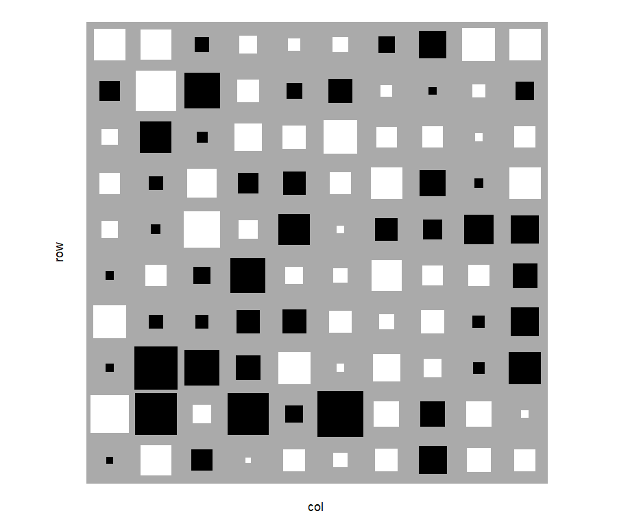

# gghinton

**Hinton diagrams for ggplot2.**

A Hinton diagram visualises a numerical matrix. Each element is displayed as a 
square where the square's area is proportional to the absolute value of the 
element. Positive values are white, negative values are black, on a grey 
background. This simple clear perceptual mapping makes interpretation of the 
structure of the matrix easy. 

```r
install.packages("hinton")

library(ggplot2)
library(gghinton)

m <- matrix(rnorm(10*10), nrow = 10)

matrix_to_hinton(m) |>
  ggplot(aes(x = col, y = row, weight = weight)) +
  geom_hinton() +
  scale_fill_hinton() +
  coord_fixed() +
  theme_hinton() + 
  theme(axis.text = element_blank())
```



## Why not a heatmap?

| | Heatmap | Hinton diagram |
|---|---|---|
| Encodes magnitude | via colour intensity | via square area |
| Encodes sign | requires diverging palette | white vs black |
| Works for colourblind readers | depends on palette | yes |
| Near-zero values | invisible colour | invisible square |
| Works at a glance | partially | yes |

Colour saturation is a notoriously unreliable channel for magnitude judgements.
Square area is not: humans compare areas accurately, pre-attentively. When
you care about *how big* and *which sign*, a Hinton diagram beats a heatmap.

Heatmaps are better when: you have large matrices (> ~50x50, where at typical 
plotting sizes you would only have a handful of pixels per element), continuous
gradients matter more than individual entries, or values are all positive and
the magnitude range is narrow.

## Installation

```r
install.packages("gghinton")  # from CRAN

pak::pkg_install("robin-foster-rf/gghinton") # development version from github
```

## Core functions

| Function | Purpose |
|---|---|
| `geom_hinton()` | Draw a Hinton diagram as a ggplot2 layer |
| `stat_hinton()` | The underlying `stat_*` (for advanced use) |
| `scale_fill_hinton()` | White/black colour scale for signed data |
| `theme_hinton()` | Clean theme: removes grid lines |
| `matrix_to_hinton()` | Convert a matrix to a tidy data frame |
| `as_hinton_df()` | Generic converter (matrix, data.frame, table) |

## Key aesthetics

```r
aes(x = col,    # column position
    y = row,    # row position (row 1 of the matrix is at the top)
    weight = w) # the value: determines size and colour
```

## The `scale_by` parameter

```r
# Default: each facet panel normalised independently
geom_hinton(scale_by = "panel")

# Global: all panels share the same scale, allows cross-panel comparison
geom_hinton(scale_by = "global")
```

## Use cases

- **Correlation matrices**: immediately spot large positive and negative correlations
- **Factor loadings**: which variables load strongly on which factors
- **Transition matrices**: Markov chain structure at a glance
- **PCA weight matrices**: understand what a principal component captures

## Design

`gghinton` follows standard ggplot2 extension conventions:

- `GeomHinton` extends `GeomRect`
- `StatHinton` computes rectangle bounds in `compute_panel` so normalization
  is consistent within each panel
- Sign detection is automatic (no need to tell the package whether your data
  is signed)
